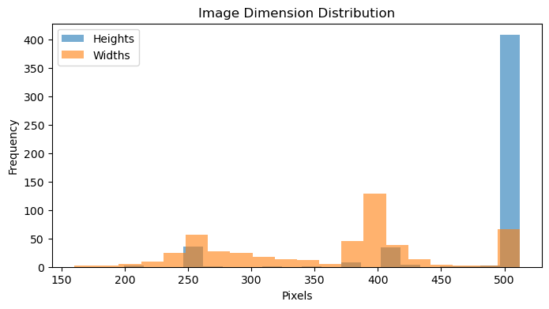
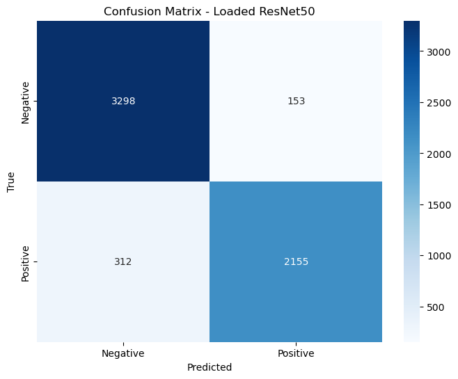
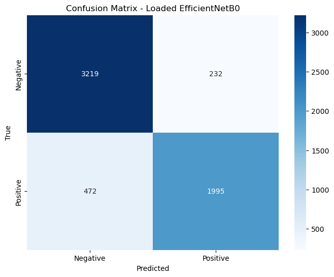
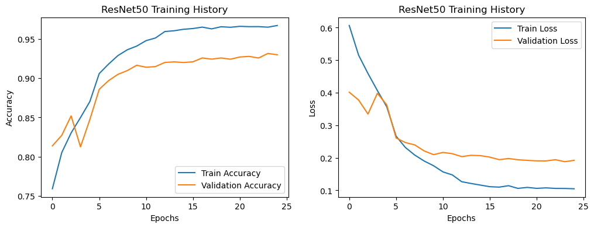

# Wrist Fracture Detection using Deep Learning on the MURA Dataset

This project presents a deep learning-based **Computer-Aided Diagnostic (CAD)** system for early and accurate detection of wrist fractures using X-ray images. It is built on filtered wrist-only data from the **MURA (Musculoskeletal Radiographs)** dataset, utilizing modern CNN architectures for high-performance classification.

## Project Motivation

Wrist fractures are one of the most common orthopedic injuries, often seen in elderly and trauma patients. Diagnosing these fractures from plain X-rays is difficult due to:
- Subtle fracture lines that are easily missed
- Subjective interpretation by radiologists
- Limited access to specialists in rural or understaffed settings

This project addresses these challenges by developing a deep learning system that automates the detection of wrist fractures from radiographs, helping reduce diagnostic delays and errors.

## Objectives

- Acquire and preprocess wrist X-ray data from the MURA dataset
- Train state-of-the-art CNN models (ResNet50 and EfficientNetB0) using transfer learning
- Evaluate models using accuracy, F1-score, ROC-AUC, sensitivity, and specificity
- Use Grad-CAM for visual explanation and model interpretability

---

## Dataset

- Source: [MURA Dataset – Stanford ML Group](https://stanfordmlgroup.github.io/competitions/mura/)
- Version used: [Better Mura](https://www.kaggle.com/datasets/sudhanshusuryawanshi/better-mura/data)
- Dataset Used: Wrist-only filtered version available in the `better-mura/` directory
- Composition: Binary classification (Normal vs. Fracture)
- Sample Format: PNG/JPG grayscale images of wrist radiographs
### Correlation Matrices

<div>

### Image Dimension Distribution

<table>
  <tr>
    <td></td>
  </tr>
</table>

</div>
---

## Preprocessing Pipeline

1. Data Filtering: Selected only wrist images using metadata
2. Image Resizing: Resized all images to 224x224 pixels
3. Normalization: Pixel values scaled between 0 and 1
4. Augmentation (training only):
   - Random rotation
   - Shear transformation
   - Brightness variation
5. Label Encoding: 
   - Fracture = 1
   - Normal = 0
6. Class Balancing:
   - Handled via class weights in the loss function: `{0: 1.0, 1: 1.5}`

---

## Model Architectures

### ResNet50
- Base Model: Pretrained on ImageNet
- Top Layers:
  - Global Average Pooling
  - Dense(64, ReLU)
  - Dropout(0.3)
  - Output: Dense(1, Sigmoid)
- Fine-Tuning: Last 15 layers unfrozen
- Optimizer: Adam
- Loss: Binary Crossentropy
- Epochs: 25
- Learning Rate: 1e-4

### EfficientNetB0
- Same top layers and configuration as ResNet50
- Lightweight and faster training compared to ResNet50
- Also pretrained on ImageNet

### Callbacks
- EarlyStopping: Based on validation loss (patience = 5)
- ReduceLROnPlateau: Reduce LR by factor of 0.2 after 2 stagnant epochs (min_lr = 1e-6)

---

## Training Configuration

- Data split: Train, Validation, Test
- Image Generator: `ImageDataGenerator` with real-time augmentation
- Hardware: Trained on local machine with TensorFlow and GPU/Metal acceleration

---

## Evaluation Metrics

- Accuracy
- Precision, Recall (Sensitivity)
- Specificity
- F1-Score
- AUC-ROC
- Confusion Matrix and ROC Curve visualization

<div>

### Confusion Matrix

<table>
  <tr>
    <td></td>
  </tr>
</table>
<table>
  <tr>
    <td></td>
  </tr>
</table>

</div>

---

## Results

| Model          | Accuracy | AUC-ROC | Sensitivity | Specificity | F1-Score |
|----------------|----------|---------|-------------|-------------|----------|
| ResNet50       | 92%      | 0.9146  | 87%         | 96%         | 0.90     |
| EfficientNetB0 | 88%      | ~0.87   | 81%         | 93%         | 0.85     |

<div>

### Loss Error

<table>
  <tr>
    <td></td>
  </tr>
</table>
<table>
  <tr>
    <td></td>
  </tr>
</table>

</div>

**Observations**:
- ResNet50 outperforms EfficientNetB0 across most metrics, including specificity and AUC.
- EfficientNetB0 still achieves high precision and is suitable for lightweight or mobile deployments.
- Both models match literature benchmarks (AUC between 0.87–0.93).

---

## Grad-CAM & Interpretability

Grad-CAM was used to visualize which regions of the X-ray influenced model predictions. However:

### Limitations of Grad-CAM:
- Subtle or fine fractures were not well-highlighted due to coarse heatmap resolution.
- Fracture locations are often small and visually ambiguous.
- Model sometimes focused on irrelevant image regions (e.g., borders or artifacts).

---

## Discussion

- Both CNN architectures demonstrated strong classification performance.
- ResNet50 is better suited for environments where high sensitivity and specificity are required.
- EfficientNetB0 provides a speed-accuracy trade-off, useful for fast inference.

---

## Limitations

- Dataset lacks pixel-level annotations or bounding boxes, making it hard for the model to focus on fracture regions precisely.
- Grad-CAM performance was inconsistent and unreliable for clinical localization.
- Data imbalance despite class weighting still affects minority class sensitivity.

---

## Future Work

- Incorporate pixel-level or bounding-box labeled datasets to improve interpretability.
- Use multi-view radiographs for improved spatial context.
- Explore Vision Transformers or attention-based CNNs.
- Improve Grad-CAM or use newer explainability tools (e.g., SmoothGrad, Score-CAM).
- Apply ensemble learning to combine strengths of multiple models.
- Validate using external datasets and radiologist-labeled images.
- Assess integration into clinical PACS or triage systems.

---

## Dependencies

Install the dependencies using the requirements file:

```bash
pip install -r requirements.txt
```

Main packages:
- tensorflow
- opencv-python
- matplotlib
- numpy
- pandas
- seaborn
- scikit-learn

---

## Folder Structure

```
├── model_final.ipynb       # Main training and evaluation notebook
├── better-mura/            # Pre-filtered wrist X-ray images
├── images/                 # Sample output images, confusion matrix, Grad-CAM
├── README.md               # Project documentation
└── requirements.txt        # Python dependencies
```

---

## License

This project is for educational and research use only. Please refer to the MURA dataset and pretrained model license agreements for any commercial use.

---

## Acknowledgements

- Stanford ML Group for providing the MURA dataset.
- TensorFlow and Keras for model training frameworks.
- All contributors to open-source tools used in this project.

